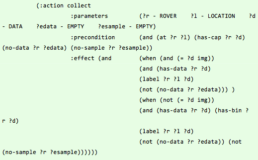
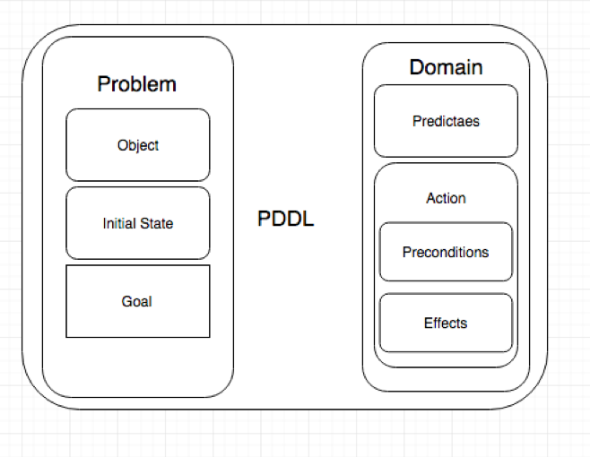
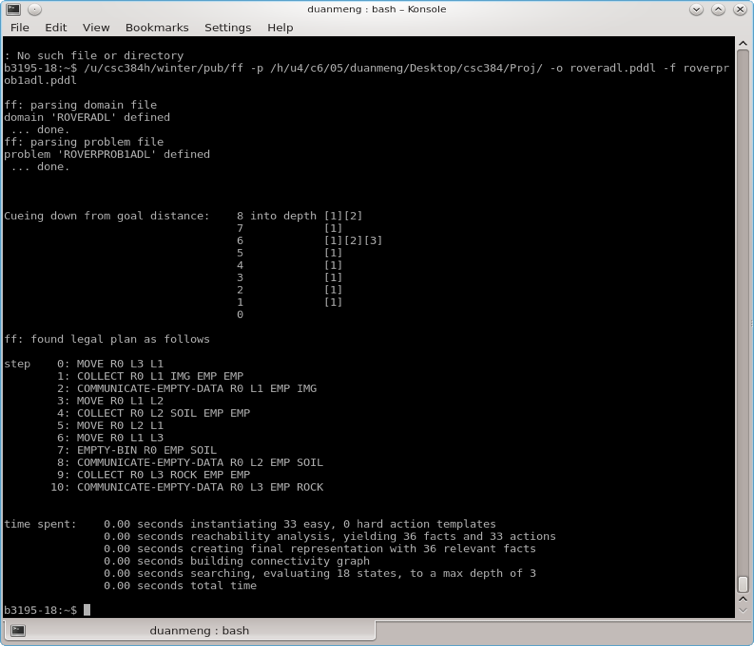
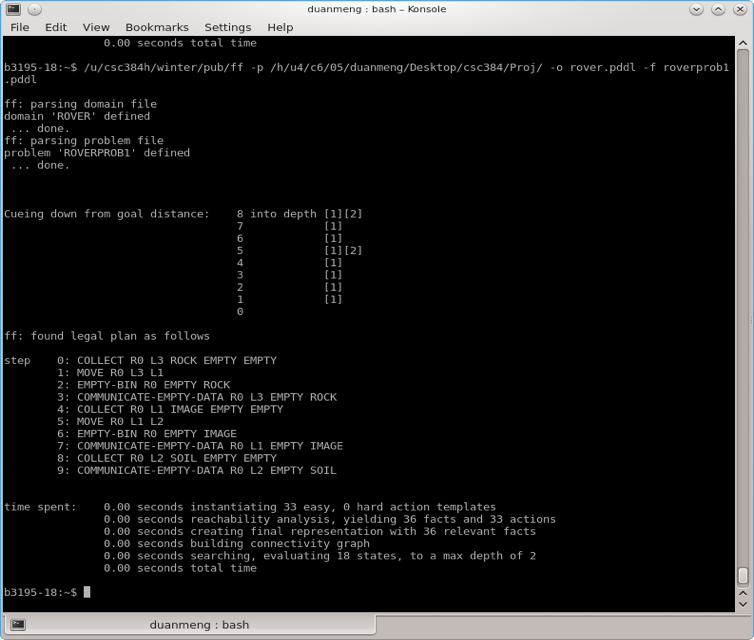
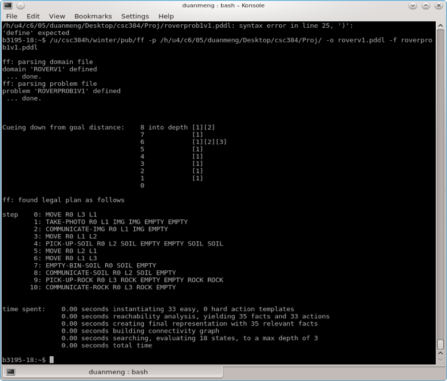

 

 

 

 

# CSC384: Project Report

#### Planning DomainDefinition Language

**In Knowledge Representation**

Due on: April 8, 2017

**Group Members:** 

S. Qin

Dawn Duan

**Roles**: Background search, codeimplementation of the Mars rover domain and problems in PDDL, and search on AIand PDDL’s applications in the video game industry have been completed as ateam. Though Sining was mainly in charge of Section 3 of the report whileMengli was mainly in charge of Section 4, there was frequent discussionhappening between the two members; the rest of the report was a cooperativeoutcome.

 

 

 

### 1.  Overview

This project consists of three main parts. A briefdescription of each part is as follows: 

​	1) **Self-learning**on the Planning Domain Definition Language (abbr. PDDL):

> Since PDDL has only been briefly mentioned in class, thisself-learning process familiarizes us with related **background**, structure and syntax. 

​	2) The **implementation** of a Mars rover planning problem: 

> A Mars rover domain where rovers autonomously wander aroundto collect samples and send back to Earth has been implemented to strengthenour understanding of PDDL. The domain has been encoded first using the STanfordResearch Institute Problem Solver (abbr. STRIPS), and then the ActionDescription Language (abbr. ADL), to investigate different levels ofexpressivity. A Fast-Forward (abbr. FF) planning system has been adopted forvalidation.

​	3) An **exploration** on how PDDL can be useful in the video game industry: 

> Research on AI applications in the video game industry hasbeen conducted. Particularly, the team has become interested in how PDDL canhelp with behavior planning for Non-Play Characters (abbr. NPC). A future projectplan in this field has been proposed.

 

### 2. Background

This section summarizes relevant background knowledge thathelps us get started on PDDL.

**Automated Planning**: Motivated from the idea of General problems solvers (abbr.GPS), automated planning aims to create planning algorithms that performsufficiently well on many application domains, including future ones [1]. Thisis referred to as being domain-independent, which means algorithms areindifferent to application domains and thus capable of general problem solving.The process of automated planning involves 1) problem formulation, 2) plannerrunning, and 3) validate plans found by planner.

**Classical Planning**: Classical planning is to develop algorithms that enableagents to find a sequence of actions from the initial to final state. As thesimplest form of automated planning, classical planning problems have thefollowing properties: finite-state, discrete, deterministic, fully-observed,offline, single agent and sequential.

**PDDL** [2]: PDDL is the de facto standard language for formulatingclassical planning problems; an illustration of its structure can be found inAppendix Figure 1. PDDL contains STRIPS, ADL and much more. Domains andproblems specified in PDDL can be passed into planners that handle varyinglevels of expressiveness to generate action plans. Most planners do not supportfull PDDL; in fact, a majority of them only support only the STRIPS subset.

- **STRIPS [3]**actions has conjunctive predicate preconditions, add effects, and deleteeffects defined in terms of action schema parameters and constant entities. Allprecondition predicates must hold for an action to be applicable in a givenstate.
- **ADL** actions extendSTRIPS’s action schemata, additionally allowing disjunctive, quantified andnegative preconditions. The syntax for describing action effects extends toallow conditional effects, applied only when the given condition holds. 

#### **3. The Mars RoverProblem**

**3.1 Method**

The task is to perform mission planning for a group ofrovers on Mars, where it is too far away for the commands to be transmittedfrom Earth. At the initial state, rovers with empty databanks and sample binsreside at certain locations. They then run through allowed paths to collectsamples in the forms of soil, rock and images, analyze them and label data withcorresponding location information. A databank or bin will be either empty orfull, that is, it can contain at most data of one type and a robot is neitherallowed to pick up other soil or rock if either of its databank or bin is full,nor to take another photo if its databank is full. Thus, before a goal statewhere desired data at certain locations is all received on Earth, rovers repeatdata emptying by sending back to Earth, and bin emptying, in order to collectmore statistics as onl. More English description can be found at [2]. 

###### 3.1.1 Domain Definition

Core components associated with the domain are summarizedbelow. If only certain constants are allowed for a type, they are included inthe bracket after that type. An assumption made for the action **Collect**(r, x, d, e-data, e-bin) is that(1) once a rock or soil is picked up, both the rover’s databank and sample willbe full, whereas (2) once a photo is taken, **only** the rover’s databank will be full, which implies that **only** the databank needs to to emptiedfor new data collection. In addition, a rover can** only** collect soil or rock if both its databank and sample bin areempty, whereas an image can be taken as long as its databank is empty.

| Types (4)                                | Predicates (9)                           |
| ---------------------------------------- | ---------------------------------------- |
| **Rover**; **Location**; **Data-type** (*soil, rock, image*); **Empty **(*empty*) | **At**(r, x) -> True iff the Rover r is currently located at  Location x;  **Path**(r, x, y) -> True iff the Rover r is allowed to travel  from Location x to Location y;  **Has-capability**(r, d) -> True iff the Rover r has the capability to  collect Data-type d;  **Databank-content**(r, d) -> True iff the Rover r has Data-type d as its  databank content;  **Bin-content**(r, d) -> True iff the Rover r has Data-type d as its  bin content;  **No-data**(r, e) -> True iff the Rover r has Empty e as its  databank content, i.e. iff it has no data;  **No-sample**(r, e) -> True iff the Rover r has Empty e as its bin  content, i.e. iff it has no sample;  **Label**(r, x, d) -> True iff the Rover r collects Data-type d  at Location x;  **Earth-has**(x, d) -> True iff Earth has received Data-type d  collected from Location x |
| Actions  (4)                             | **Move**(r, x1, x2): If Path(r, x1, x2), At(r, x1) is deleted  while At(r, x2) is added;  **Collect**(r, x, d, e-data, e-bin): If Has-capability(r, d) &  No-data(r, e-data) & No-sample(r, e-bin),   ❖      If d is of  Data-type image -> No-data(r, e-data) is deleted, while Databank-content(r,  d) and Label(r, x, d) are added  ❖      If d is of  Data-type rock or soil -> No-data(r, e-data) and No-sample(r, e-bin) are  deleted, while Databank-content(r, d), Bin-content(r, d) and Label(r, x, d)  are added  **Communicate-and-empty-data**(r, x, e, d): If Databank-content(r, d),  Databank-content(r, d) and Label(r, x, d) are deleted, while No-data(r, e)  and Earth-has(x, d) are added  **Empty-bin**(r, e, d): If Bin-content(r, d), Bin-content(r, d) is  deleted, while No-sample(r, e) is added. |

Table 1: Domain Definition

###### 3.1.2 Problem Definition

Although more complex problems have been examined, only thedefinition of a very simple example is presented here. In this case, a singlerover, who is capable of collecting all data types and have both an emptydatabank and an empty bin initially, is to travel through 4 locations and sendback data of three samples of distinct data types.

| Objects                                  | Initial State                            | Goal State                               |
| ---------------------------------------- | ---------------------------------------- | ---------------------------------------- |
| Rover: **r0**;  Location: **x0**, **x1**, **x2**, **x3** | At(r0, x3);   Has-capability(r0, soil); Has-capability(r0, rock);  Has-capability(r0, image);  No-data(r0, empty); No-sample(r0, empty);  Path(r0, x3, x0); Path(r0, x0, x3); Path(r0, x3, x1);  Path(r0, x1, x3); Path(r0, x1, x2); Path(r0, x2, x1) | Earth-has(x1, image);  Earth-has(x2, soil); Earth-has(x3, rock) |

Table 2: Problem Definition Example

###### 3.1.3 Method Comparison

We have attempted three implementations, (1) a complexSTRIPS version, (2) a simple STRIPS version, and (3) an ADL version, each beingmore concise and/or accurate. 

With *Method 1*, a total of 12 types, 18predicates, and 9 actions have been declared to fully represent the domain.This unnecessary amount is due to failures in understanding the nature of‘types’ with constants, which can take different values and be accessed andutilized by all actions. For example, instead of having *soil* as one of the constant values associated with a single type **Data-type**, there are duplicate types of **Data-soil**, **Bin-soil** and **Cap-soil**,each with *soil* as their sole allowedvalue. As a result, instead of having a single predicate **Databank-content**, there are separate ones including **Databank-content-soil**, **Databank-content-rock** and **Databank-content-image**; instead of asingle action **Collect**, there is anaction breakdown consisting of **Pickup-soil**,**Pickup-rock** and **Take-image**. 

The waste of STRIPS’ expressivity has been corrected in *Method 2*, where there are only two typeswith constants: **Data-type** and **Empty**. Numbers of predicates andactions also shrink to normal as expected in Table 1. However, one shortcomingdoes exist -- though being one of the constant values of **Data-type**, *image* isdifferent from *soil* and *rock* in terms of preconditions andeffects (i.e. neither requires empty bin nor takes up bin space), but STRIPSdoes not support the conditionality for it to be properly distinguished. As aresult meaningless actions in the form of **Empty-bin(r,e, image)** can be noticed fromplans generated by planners (Appendix Figure 3).

This dilemma is handled by ADL’s support for **negative literal**, **equality**, and **conditionaleffects**. The final implementation of **Collect**is as follows:

Figure: ADL implementation ofaction **Collect**

##### **3.2 Evaluation**

FF is a domain independent planning system capable ofhandling classical STRIPS- as well as full-scale ADL- planning tasks [4]. It isa forward chaining heuristicstate space planner, having a non-admissible heuristic that obtainsheuristic estimate by ignoringthe delete lists of all operators. It is one of the few **fastest**, **non-optimal **planners[5].

The domain and problemdefinitions above are passed into FF to for firstly syntax error check andlater plan generation; the generated plans are then investigated manually forcorrect problem representation and optimality. As shown in Appendix Figure 2-4 (and by plans generated for other more complex Mars rover problems), it isnotable that FF can give out different plans given varying domain definitionsfor a same specific problem from that task category, as a result of itsnon-optimality. 

Therefore, for moreconsistent plan generation, it is of our interest to investigate optimalplanners in the future. However, we also realize that for complex problemswhere search of a planner can take a very long time, the quickness to reach agood solution might be more practical and desirable than optimality.

#####                                     

### 4. PDDL in VideoGame Industry

##### 4.1 Discussion onthe Video Game Industry

AI research on designs and implementations of cognitiveagents has been extensively developed in academia. Various implementations withlogic programming involving different AI techniques and mentalities have beenpublished in past 10 years. As a subfield of AI, knowledge representation is atthe very core of a radical idea for understanding intelligence, i.e. cognitivereasoning [6]. Cognitive agents are considered as intelligent agents withhigher-level cognitive abilities such as reasoning [7]. The abilities tocommunicate, think ahead and plan before acting, coordinate and communicatewith other agents all constitute cognitive abilities. “Reasoning” of an agentmeans the capacity to sense the world, and the awareness of its goals,available actions, as well as states of other agents [7]. One of the crucialfeatures of cognitive agents is the ability to make decisions, as ademonstration of reasoning. 

###### 4.1.1 AI Applications in the Video Game Industry [8] 

In a general view, there are not a lot of practical use ofAI research yet because of the advancement of the topics. Video game industryis one of the fields that have great potential to employ AI technologies tosolve problems. However, it has not been fully explored yet.  Proactive behaviors of the NPCs are of agreat match to cognitive agents. “Proactive”, also called “thinking beforeaction”, refers to an agent being deliberate about potential outcomes ofactions. As one of the core features of cognitive agents, decision-making ingame development seems to be a promising application in terms of realizing this“thinking before acting” agents (NPCs) via an AI technique. The AI technique,namely classical planning, is one of the most fundamental forms of automatedplanning problems, i.e. deliberating about the effects of actions [8]. 

However, there is clearly a gap between cognitive agents inacademia and the associated use in video game industry. The gap could be causedby some technical difficulties, viz. the high computational cost with respectto memory and computing time that requires. Thus, this may be hard to get theagents responsive under the real-time setting. Additionally, due to the lack ofcommunication with non-academic fields, AI research tends to have differentfocuses. As a result, it’s hard for game developers to directly utilize AIresearch as a helper tool to address some of the issues in the gaming designfields. Hence, an AI system-based tool for video game developing is on request.It needs to consider the usability to the developers, real-time efficiency andeffectiveness to relevant problems faced in gaming design. 

Motivated by situations where hardware for game enginebegins to follow up on the computing power that is able to support functionalAI technologies, a paper by Vassos takes a close look at the conditions thatguarantee the real-time efficiency of AI technologies in a video game. Itsinvestigation is centered at proactive behaviors of NPCs in First-PersonShooter (abbr. FPS) genre of video gaming as goal-oriented planning.Specifically, with a focus on FPS games and the NPCs that act against the humanplayer, the paper intends to quantify the performance of planners with the hopeto identify suitable ones for guiding NPCs behaviors in real-time. To do so,random planning problem instances expressed in STRIPS with user definedproperties are generated. The results obtained are based on SimpleFPS instancesthat have various domain sizes, as SimpleFPS provides a precise specificationof the game world. In other words, it introduces a specific planning domain,i.e. well-defined facts and properties that constitute the high-level actionsof the NPCs.

###### 4.1.2 PDDL Applications in the Video Game Industry [9]

As an example demonstrated by Vassos’s recent work, PDDL ispowerful and convenient in planning proactive behaviors of NPCs in FPS. In theview of game developers, a high-level intuitive language similar to Englishwill be convenient to realize behaviors of agents, i.e. NPCs, and thus isexpected to be useful, making PDDL a matched tool. Moreover, it is natural touse PDDL to formulate specifications of a game world if the world is definedexplicitly enough. That is, a full description about the initial states, a listof actions that records all possible transitions of the world, and a goalcondition which can get transformed from the initial state by performing asequence of actions.

###### 4.1.3 Goal-Oriented Action Planning (abbr. GOAP)

The goal-oriented planning in the aforementioned paperaccounts for the different branches of classical planning that have beensuccessfully implemented in game development. Generally, GOAP refers tosimplified STRIPS-like architectures for real-time control on behaviors of autonomouscharacters in the game [10]. On top of the classical planning techniques, GOAPallows characters to take a step further in decision making process, from whatto do, to how to do it [11]. GOAP is of advantages in both development andruntime perspectives [11]. The behaviors can be encoded in a more reusable andmaintainable way [11].

##### 4.2 Future plan

A future plan is to formulate the simpleFPS game as a domainusing PDDL and program an automated problem definition generator. Moreover, wehope to employ Finite State Machine (abbr. FSM)to construct a more complex game world and utilize more sophisticatedtechniques like GOAP to solve planning problems.

####  

### **5. Conclusions**

The notion of using standardized languages, e.g. PDDL, todefine domains and problems in a way that enables planners to solve planningdomain-independently is very exciting. We hope our self-learning on PDDL caneventually enables us to transform complex real-world problems to similar formsthat can be solved in an easier way.

 

 

 

### **References**

[1] Helmert, Malte, and Gabriele R ̈oger. *http://ai.cs.unibas.ch/*. N.p., 2015.Web. 8 Apr. 2017

[2] University of Toronto CSC384 Teaching Team. (2011).Planning and Bayesian Networks. [http://www.cs.utoronto.ca/~sheila/384/w11/Assignments/A3/csc384w11-a3-part1f.pdf](http://www.cs.utoronto.ca/~sheila/384/w11/Assignments/A3/csc384w11-a3-part1f.pdf)

[3] "Handling ADL". *CMU CS*. N.p., 2017. Web. 8 Apr. 2017.

[4] "FF Homepage". *Fai.cs.uni-saarland.de*. N.p., 2017. Web. 8 Apr. 2017.

[5] "Running The Planners". *https://www.ida.liu.se*. Web. 8 Apr. 2017.

[6] "Cognitive Robotics » Books". *Cs.toronto.edu*. Web. 8 Apr. 2017.

[7] Vassos, Stavros. "Practical AI Modules ForNon-Player Characters In Video Games". *http://stavros.lostre.org/*.Web. 8 Apr. 2017.

[8] Vassos, Stavros. "Real-Time Action Planing WithPreconditions And Effects (Gamecodermag-2012) Stavros Vassos Web Corner". *Stavros.lostre.org*. Web. 8 Apr. 2017.

[9] Vassos, Stavros, and Michail Papakonstantinou. "TheSimplefps Planning Domain: A PDDL Benchmark For Proactive Npcs". *http://stavros.lostre.org*. Web. 8 Apr.2017.

[10] Orkin, Jeff. "Goal-Oriented Action Planning(GOAP)". *Alumni.media.mit.edu*.Web. 8 Apr. 2017.

[11] Orkin, Jeff. "Applying Goal - Oriented ActionPlanning To Games". *http://alumni.media.mit.edu/*.Web. 8 Apr. 2017.

 

 

**Appendix: UsefulFigures**

 

 

Figure 1: PDDL Paradigm

 

 

 

Figure 2: Resulted Plan for the ADL Domain from a FFPlanner  

Figure 3: Resulted Plan for the Simple STRIPS Domain from aFF Planner 

 

 

 

Figure 4: Resulted Plan for the Complex STRIPS Domain from aFF Planner 

 

** **

| AI     | Artificial Intelligence                  |
| ------ | ---------------------------------------- |
| FPS    | first-person shooter                     |
| FSM    | Finite State Machine                     |
| GOAP   | goal-oriented action planning            |
| GPS    | General Planning Solver                  |
| NPCS   | non-player characters                    |
| PDDL   | Planning Domain Description  Language    |
| STRIPS | Stanford Research Institute  Problem Solver |

Table 3:Abbreviations
